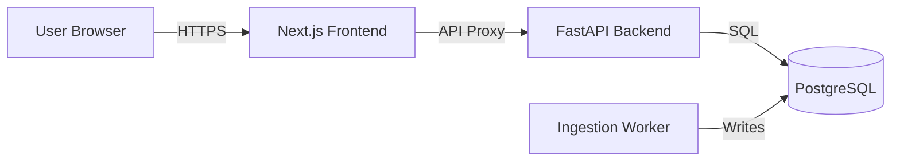

# Cloud Cost Copilot

**An intelligent dashboard for monitoring and analyzing cloud infrastructure costs in near real-time.**

Cloud Cost Copilot is a full-stack application designed to visualize cloud spending patterns, detect anomalies, and provide actionable insights. Built with modern technologies, it demonstrates a complete data pipeline from ingestion to visualization.


## Tech Stack

This project utilizes a robust, containerized architecture:

*   **Frontend**: [Next.js 14](https://nextjs.org/) (React) with [Tailwind CSS](https://tailwindcss.com/) for a responsive and performant UI.
*   **Backend**: [FastAPI](https://fastapi.tiangolo.com/) (Python) for high-performance API endpoints and data processing.
*   **Database**: [PostgreSQL](https://www.postgresql.org/) for reliable relational data storage.
*   **ORM**: [SQLAlchemy](https://www.sqlalchemy.org/) for database interaction.
*   **Infrastructure**: [Docker Compose](https://docs.docker.com/compose/) for orchestration and easy deployment.

## Key Features

### 1. Interactive Cost Dashboard
*   **Visual Analytics**: View cost trends over time with dynamic charts.
*   **Granular Filtering**: Filter expenses by date range and specific cloud services (e.g., EC2, S3, RDS).
*   **Aggregated Metrics**: Instantly see total costs and daily breakdowns.

### 2. Anomaly Detection (Simulation)
*   **Smart Alerts**: The system identifies unusual spending spikes (e.g., 200% increase in daily costs).
*   **Severity Levels**: Alerts are categorized by severity (High/Medium/Low) to prioritize attention.

### 3. Secure Architecture
*   **Token-Based Authentication**: Secure API communication between frontend and backend using shared tokens.
*   **Environment Isolation**: Strict separation of concerns using Docker containers for Frontend, Backend, and Database.

## Architecture

The application checks for costs via a secure proxy, preventing direct database exposure:



## Getting Started

### Prerequisites
*   Docker & Docker Compose
*   Node.js (for local frontend dev)

### Installation

1.  **Clone the repository**:
    ```bash
    git clone https://github.com/Andalexskywalker/cloud-cost-copilot.git
    cd cloud-cost-copilot
    ```

2.  **Environment Setup**:
    ```bash
    cp .env.example .env
    # Adjust .env variables if needed
    ```

3.  **Run with Docker**:
    ```bash
    make up
    # OR
    docker compose up -d --build
    ```

4.  **Access**:
    *   **Frontend**: [http://localhost:3000](http://localhost:3000)
    *   **API Docs**: [http://localhost:8000/docs](http://localhost:8000/docs)

## Project Highlights
*   **Full-Stack Integration**: Seamlessly connects a React/TypeScript frontend with a Python backend.
*   **Dockerized Workflow**: Ensures consistency across development and production environments.
*   **Data Visualization**: Implements responsive charts to make complex data easily understandable.
